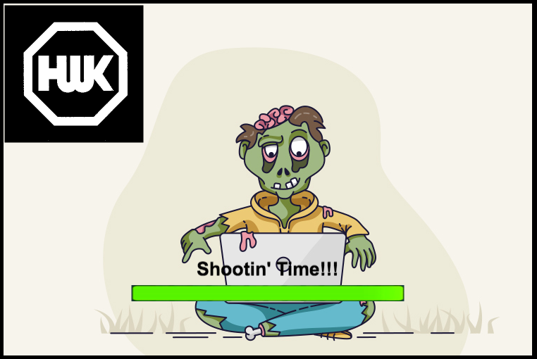
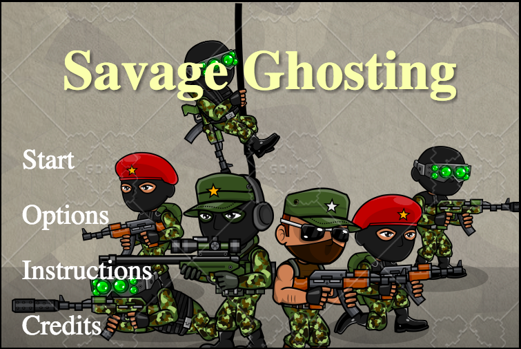
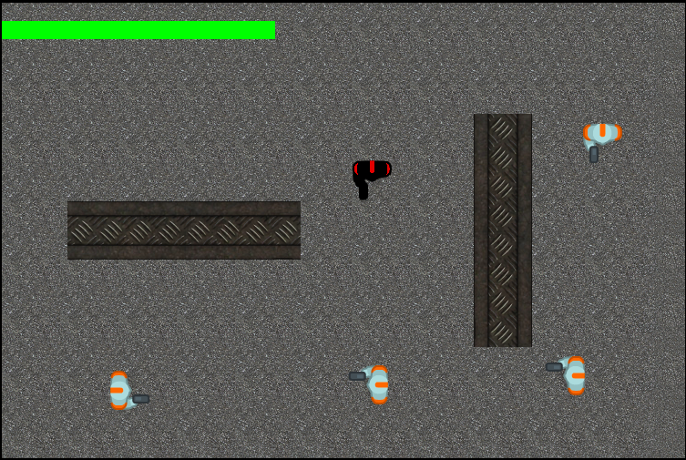

# SAVAGE GHOSTING
by William McKelvey, Heidi Marsh, Kristoffer Panahon  

## Production App
https://savage-ghosting.herokuapp.com/

## Description
You and a group of your friends (or enemies) enter the arena. You must duck, dodge, shoot, scream,...unleash absolute SAVAGERY until a victor is the last one standing. 

## Objective of Game
You and up to at least 5 other friends (Its what we have tested so far, probably more) enter the arena.  You get to shoot, dodge, and survive until either you or your competitor is named the victor.  If you do die, don't worry, your ghost has a surprise. 

## Technology Used
**FrontEnd**: HTML, CSS, Phaser, Javascript  
**BackEnd**: NodeJS, Express, Socket.io  
**Deployment**: Heroku  

## Things to Look Into For Future of the Game
* Display Scores
* NPCs (Non-Playable-Characters)
* Mobile Platforms
* Google Authorization
* Add powerups 

**Note** The sprites and music in the `static` folder will be used in the future!

## How to Use our code
* Fork it to your Repo
* Git clone the Repo link
* Move into the project directory: `cd ~/YOUR_PROJECTS_DIRECTORY/YOUR_PROJECT_NAME`
* Make sure you do a `npm install` in the server folder before doing anything
* Run `npm start` in order to build the production app
* Type `localhost:5000` in your web browser and it should be up and running locally.

**Note** You will need to close the current server that is running and run `npm start` everytime you make a change.  

## Phaser Documentation 
https://phaser.io/docs/2.6.2/index

## Screenshots
#### Loading Screen  
When you start the website, the loading screen appears and completes only when it finishes preloading every sprite, background, and music we used in the game.  
  

#### Menu Screen  
Once the game finishes loading, you are directed to the menu screen! You will have the option to play the game, see the game instructions, see the options, and see the credits for the game.  
  

#### InfoModal Screen  
If you selected the Instructions Option, you will see the game instructions. You can click on the Back button to return to the Menu screen.  
  

#### Option Screen  
If the music becomes a bit much for you, you can enter the option screen to turn it off. You can click on the Back button to return to the Menu screen.  
  

#### Game Screen  
If you selected the Start Button, you are directed to the game. Wait for other players and enjoy!  
  

